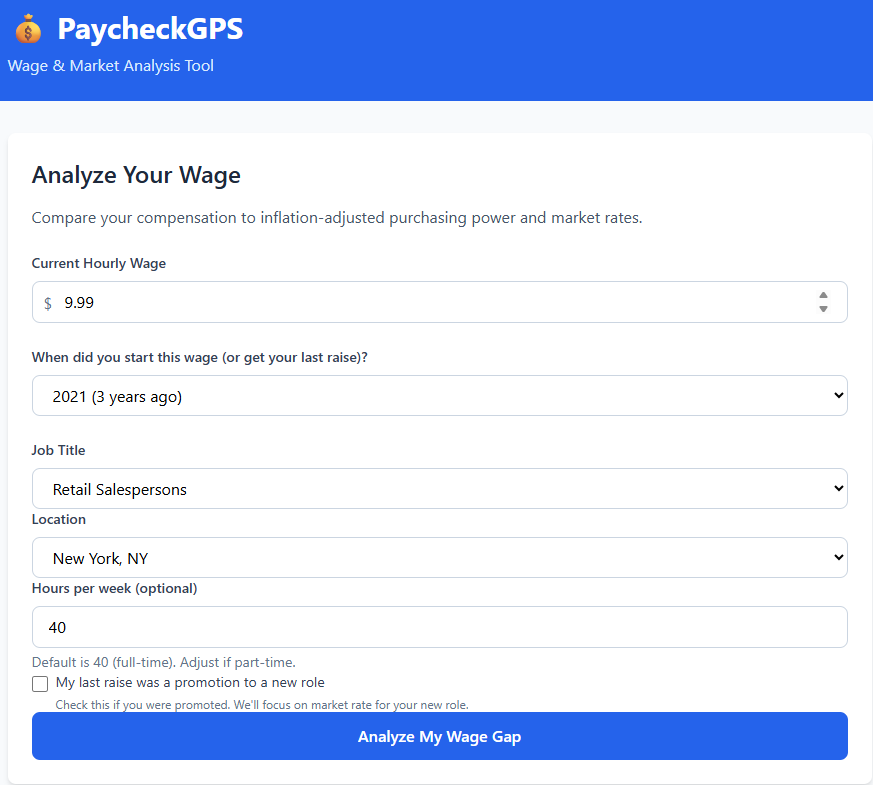

# PaycheckGPS

A wage gap calculator that shows workers how much they're losing to inflation and market competition.

## Live Demo
   👉 [paycheckgps.netlify.app](https://paycheckgps.netlify.app/)

   ## Screenshots
   
   
   
   

## What It Does

Compares your current wage against two benchmarks:
- **Inflation-adjusted purchasing power** (2020-2024 CPI data)
- **Current market rates** by job title and location

Shows you the annual financial impact of wage gaps.

## Example

A retail worker in NYC earning $13.50/hr since 2021:
- Should be making $16.57/hr to maintain purchasing power
- Market rate is $19.45/hr
- **Gap: $9,776/year**

## Tech Stack

- Vanilla JavaScript
- Tailwind CSS
- BLS labor market data (2023-2024)
- Static deployment (Netlify)

## Features

- 14 job categories across 8 major cities
- Real inflation data (2020-2024)
- Market-adjusted wage benchmarks
- 5-year financial projection
- Mobile responsive

## Author

Built by Derek as part of a career transition from 20+ years in retail operations to AI/LLM development roles.

## License

MIT
